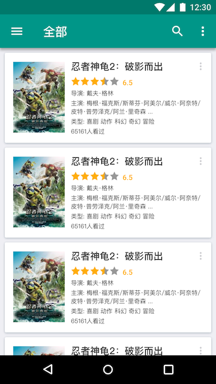
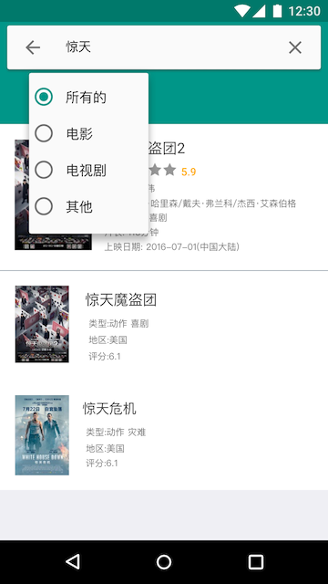
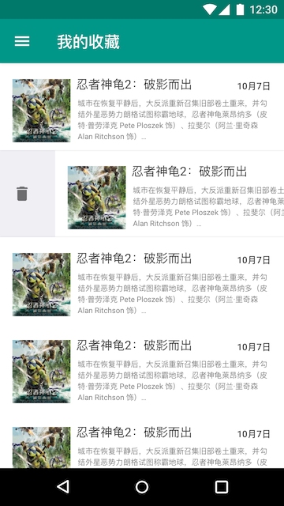

# DoubanMovie-Android

## Description

This is a movie explore app using douban movie api. And iOS version is there [DoubanMovie-iOS](https://github.com/chaoyang805/DoubanMovie)

## Feature

- Show popular movies in theater.

  

- Show All movies now in theater

  

- View movie's detail.

  

  

- Search movie or tv shows

  

  

- Add the movie you love to your favorites collection

  

### Uses of frameworks

- [RxJava](https://github.com/ReactiveX/RxJava) 
- [Databinding](https://developer.android.com/topic/libraries/data-binding/index.html) 
- [Retrofit](https://github.com/square/retrofit)
- [Gson](https://github.com/google/gson/)
- [Glide](https://github.com/bumptech/glide)

- [Douban (豆瓣) public api](https://developers.douban.com/wiki/?title=movie_v2) 

### License

This app is under the Apache 2.0 license 